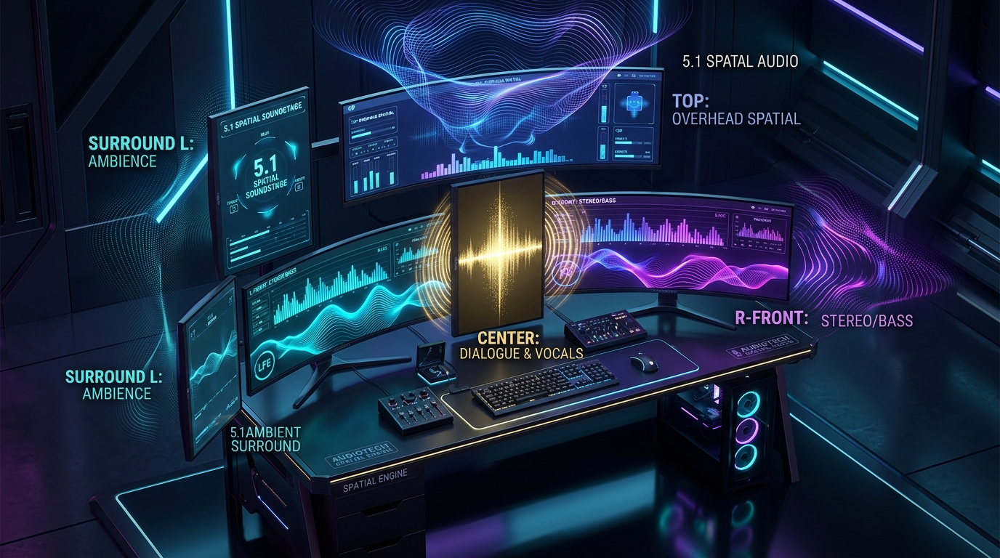

# 🔱 SurroundSoundMonitorSetup

<div align="center">



**Automatic Multi-Monitor Audio Setup & Spatial Soundstage Calibrator for Linux (PipeWire / PulseAudio / WirePlumber)**

[](https://opensource.org/licenses/MIT)
[]()
[](https://jtgsystems.com)

*Turn your multi-monitor computer battlestation into a cohesive **Spatial Surround Sound (5.1 / 7.1)** or **Unified Wide Stereo (Wall of Sound)** acoustic array in seconds using your screens as speakers.*

</div>

---

## ✨ Features

- 🖥️ **Zero-Config Display & Audio Topology Discovery**: Auto-detects all connected HDMI/DisplayPort audio endpoints across NVIDIA GPUs, AMD iGPUs/dGPUs, and Intel graphics, analyzing the physical screen coordinates ($X, Y$).
- 🎚️ **Automatic Hardware Level Calibration**: Balances individual monitor physical speakers (e.g. 90%) while keeping master volume comfortable (e.g. 20%).
- 🔊 **Instant 1-2-3 Sound Profiles**:
  - `[1]`: **Unified Wide Stereo (Wall of Sound)** — Parallel synchronized wide stereo across all monitors with balanced center fill.
  - `[2]`: **5.1 Spatial Surround Sound** — Discrete channel routing (Center dialogue on middle/top displays, bass on 34" ultrawides, surround wings on outer screens).
  - `[3]`: **7.1 Immersive Surround** — Multi-channel surround for 4+ screen battlestations.
- ⚔️ **Interactive 1v1 Audio Battle**: Built-in soundcheck and A/B test suite with synthesized multi-track stems and voice channel checks.
- 🌐 **YouTube Open Source / CC Audio Downloader**: Pulls Creative Commons surround sound reference tests via `yt-dlp`.
- 💾 **One-Click Persistence**: Automatically writes PipeWire drop-ins (`~/.config/pipewire/pipewire-pulse.conf.d/`) and desktop autostart so your audio profile survives reboots.

---

## 🚀 Installation & Quick Start

```bash
# Clone the repository
git clone https://github.com/jtgsystems/SurroundSoundMonitorSetup.git
cd SurroundSoundMonitorSetup

# Install locally
pip install -e .
```

### Run Interactive Menu:
```bash
surround-sound-monitor-setup
# or short alias:
ssms
```

### CLI Quick Commands:
```bash
# Auto-detect your workstation setup and instantly apply the optimal profile
ssms auto

# Switch to Wide Stereo profile
ssms stereo

# Switch to 5.1 Surround profile
ssms surround

# Run 1v1 Audio Comparison Battle
ssms battle

# List detected monitor audio endpoints and assigned spatial roles
ssms list
```

---

## 📐 Spatial Layout Architecture

```
                                [Top Ultrawide: LG 34"]
                                (Center Height / Dialogue)

                              [Center Vertical: LG 29"]
                                 (Center Vocal Anchor)

[Bottom-Left: Samsung 34"]                                 [Bottom-Right: Samsung 34"]           [Far-Right: Dell 27"]
   (Front Left + Bass)                                        (Front Right + Bass)             (Rear / Right Surround)
```

---

## 🏆 Created by JTG Systems

<div align="center">


**Engineered with pride by [JTG Systems](https://jtgsystems.com)**  
*Leading computer systems, enterprise networking, and custom workstation architecture.*

🌐 **Website**: [jtgsystems.com](https://jtgsystems.com)  
☕ **Tips & Sponsorship**: `jtgsystems@gmail.com`

</div>

---

## 🔍 Keyword Cloud & Search Index (Tags & Queries)

<details>
<summary><strong>Expand Exhaustive Search Index & Compatibility Keywords</strong></summary>

### 🏷️ Primary Keywords & Search Queries:
`multi monitor audio setup` · `use monitor speakers as surround sound` · `combine all monitor speakers linux` · `play audio through all monitors simultaneously` · `pipewire multi monitor audio` · `pulseaudio combine sinks multiple monitors` · `5.1 surround sound using monitor speakers` · `7.1 surround sound multi display` · `battlestation surround sound without speakers` · `dual monitor audio splitter linux` · `triple monitor surround sound setup` · `5 monitor audio wall of sound` · `simultaneous hdmi audio output linux` · `play sound on two monitors at the same time` · `combine hdmi and displayport audio linux` · `nvidia pro-audio multi hdmi output pipewire` · `wireplumber combine multiple audio sinks` · `spatial audio multi screen battlestation` · `monitor speakers spatial soundstage calibrator` · `linux virtual 5.1 surround sound sink` · `linux virtual 7.1 surround sound sink` · `display sound merger` · `multi screen sound fusion` · `screen surround sound linux` · `jtgsystems surround sound monitor setup` · `ssms audio tool` · `pipewire module-combine-sink automatic configuration`

### 💻 Supported Display Servers & Desktop Environments:
`KDE Plasma 6 Wayland kscreen-doctor audio` · `Hyprland hyprctl monitor audio setup` · `Sway swaymsg audio sink merger` · `GNOME Wayland simultaneous audio output` · `X11 xrandr multi monitor sound synchronization` · `Arch Linux pipewire audio setup` · `Ubuntu Debian Fedora OpenSUSE Linux Mint Pop OS audio soundstage`

### 🎮 Gaming & Workstation Audio Profiles:
`gaming battlestation audio optimization` · `curved ultrawide monitor bass audio routing` · `vertical monitor center dialogue speaker` · `overhead top monitor spatial audio height channel` · `simultaneous sound card combine sinks` · `lossless 48000Hz 24-bit 32-bit float audio fusion` · `zero latency monitor speaker synchronization` · `pipewire loopback spatial matrix` · `virtual surround sound headphones and monitors`

### 🛠️ Hardware & Audio Standards:
`NVIDIA GeForce RTX 4090 4080 4070 4060 HDMI Audio` · `AMD Radeon RX 7900 7800 6800 RDNA iGPU Raphael Audio` · `Intel Arc Iris Xe Display Audio` · `Samsung Odyssey C34 C49 Ultrawide Built-in Speakers` · `LG UltraGear UltraWide 34WP 29WP Built-in Speakers` · `Dell UltraSharp Alienware Display Audio` · `ASUS ROG Swift TUF Gaming Monitor Speakers` · `BenQ Mobiuz Acer Predator AOC MSI Gaming Display Audio` · `LPCM 5.1 Surround Sound` · `LPCM 7.1 Surround Sound` · `Dolby Digital 5.1 Channel Mapping` · `ALSA ELD EDID Audio Parser`

</details>

---

## 📜 License

MIT License © 2026 [JTG Systems](https://jtgsystems.com).
